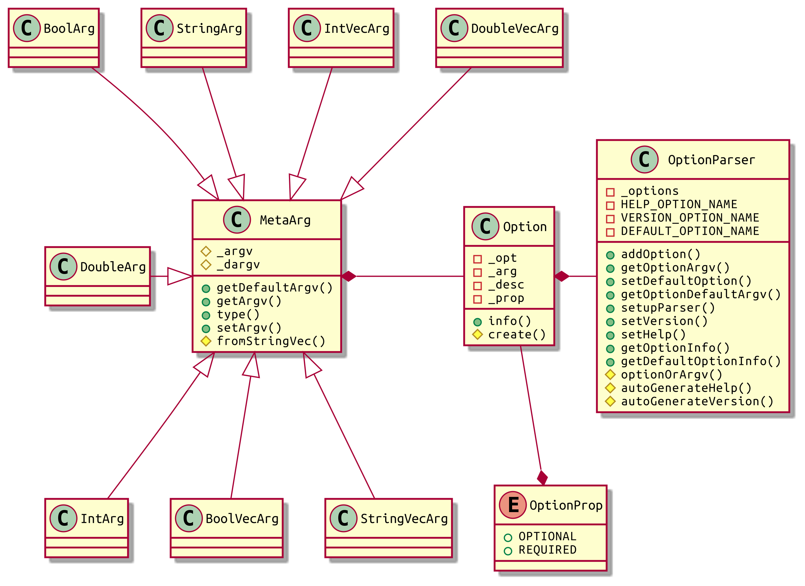
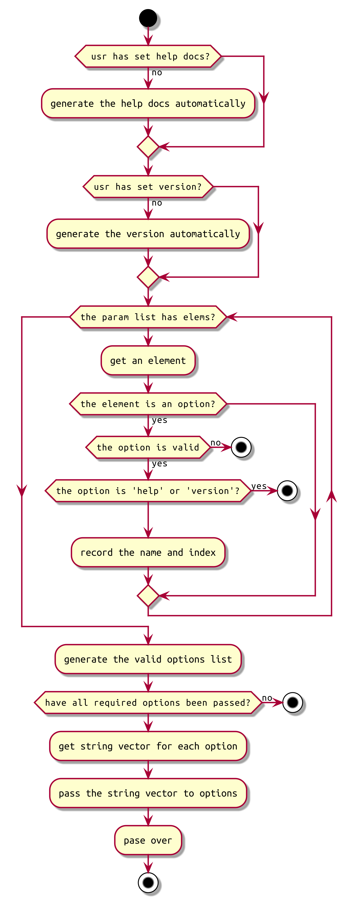

># Flags-Template
>
>___name: csl___

>___E-Mail: 3079625093@qq.com___

```cpp
    _|_|  _|                                    
  _|      _|    _|_|_|    _|_|_|    _|_|_|      
_|_|_|_|  _|  _|    _|  _|    _|  _|_|          
  _|      _|  _|    _|  _|    _|      _|_|      
  _|      _|    _|_|_|    _|_|_|  _|_|_|    _|  
                              _|                
                          _|_|                  
                                                                      
  _|                                          _|              _|      
_|_|_|_|    _|_|    _|_|_|  _|_|    _|_|_|    _|    _|_|_|  _|_|_|_|    _|_|    
  _|      _|_|_|_|  _|    _|    _|  _|    _|  _|  _|    _|    _|      _|_|_|_|  
  _|      _|        _|    _|    _|  _|    _|  _|  _|    _|    _|      _|        
    _|_|    _|_|_|  _|    _|    _|  _|_|_|    _|    _|_|_|      _|_|    _|_|_| 
                                    _|                                
                                    _|                                
```

[TOC]

## 1. OverView

this is a simple 'program-command-line-parameter-parsing' library using cpp-template.

the main functions:

+ Add command line parameters to the specified program and set the relevant properties of the command line parameters;
+ Parse the passed in parameters based on the set command line parameters;
+ During parsing, identify and check the command line parameters (such as wrong type, wrong option name, inconsistent selectability);

## 2. Structure




the steps




## 3. Usage

### Example for Source Code

```cpp
#include "flags.hpp"

using namespace ns_flags;

int main(int argc, char const *argv[]) {
  /**
   * @brief try-catch is not necessary but it is strongly recommended,
   * because you can get a lot of advice when there are errors in your code
   */
  try {
    OptionParser parser;
    /**
     * @brief define some kinds of arguements
     * [int, std::string, bool, double]
     * std::vector<[int, std::string, bool, double]>
     */
    parser.addOption<IntArg>("id", 0, "the id of current thread");
    parser.addOption<StringArg>("usr", "null", "the name of usr");
    parser.addOption<BoolArg>("sex", true,
                              "the sex of usr [male: true, female: false]");
    parser.addOption<DoubleArg>("height", 1.7, "the height of usr", OptionProp::REQUIRED);
    parser.addOption<IntVecArg>("ids", {1, 2, 3}, "the ids of threads");
    parser.addOption<StringVecArg>("lans", {"cpp", "python"},
                                   "the used langusges of usr");
    parser.addOption<BoolVecArg>("choice", {true, false}, "the choice of usr");
    parser.addOption<DoubleVecArg>("scores", {2.3, 4.5}, "the score of usr");
    /**
     * @brief set version and help docs
     * @attention if you do not set the help docs, then the help docs
     * will generate automatically
     */
    parser.setVersion("2.0.0");
    // parser.set_help("");

    parser.setDefaultOption<StringVecArg>({""}, "the default option", OptionProp::REQUIRED);
    /**
     * @brief finally, you can set up the parser and then use these arguements
     */
    parser.setupParser(argc, argv);

    /**
     * @brief print the info of arguements
     */
    std::cout << parser << std::endl;
    std::cout << parser.getDefaultOptionInfo<StringVecArg>() << std::endl;

    /**
     * @brief use the arguements
     */
    auto id = parser.getOptionArgv<IntArg>("id");
    std::cout << "the 'id' I get is: " << id << std::endl;
  } catch (const std::exception &e) {
    std::cerr << e.what() << '\n';
  }
  return 0;
}
```

### Output

_if you want to over view the example log file for command lines and outputs, please click [the log file](./output/log.log)._

if run command line:

```shell
./flags hello "I'm" flags!
```

will output:

```cpp
[ error from 'libflags'-'setupParser' ] the option named '--height' is 'OptionProp::REQUIRED', but you didn't use it
```


if run command line:

```shell
/flags hello "I'm" flags!  --height 98.8 --sex true --usr csl --id 12 --choice true false true --ids 12 34 123 --scores 12.3 45.6 78.9 --lans cpp java python html
```

will output:

```cpp
OptionParser Info: {
  {'opt': def-opt, 'type': StringVecArg, 'desc': the default option, 'prop': Required};
  {'opt': choice, 'type': BoolVecArg, 'desc': the choice of usr, 'prop': Optional};
  {'opt': ids, 'type': IntVecArg, 'desc': the ids of threads, 'prop': Optional};
  {'opt': scores, 'type': DoubleVecArg, 'desc': the score of usr, 'prop': Optional};
  {'opt': lans, 'type': StringVecArg, 'desc': the used langusges of usr, 'prop': Optional};
  {'opt': height, 'type': DoubleArg, 'desc': the height of usr, 'prop': Required};
  {'opt': sex, 'type': BoolArg, 'desc': the sex of usr [male: true, female: false], 'prop': Optional};
  {'opt': usr, 'type': StringArg, 'desc': the name of usr, 'prop': Optional};
  {'opt': version, 'type': StringArg, 'desc': display the version of this program, 'prop': Optional};
  {'opt': id, 'type': IntArg, 'desc': the id of current thread, 'prop': Optional};
  {'opt': help, 'type': StringArg, 'desc': display the help docs, 'prop': Optional};
}
{'opt': def-opt, 'type': StringVecArg, 'desc': the default option, 'prop': Required, 'default': [], 'value': [hello, I'm, flags!]}
the 'id' I get is: 12
```

if run command line:

```shell
./flags --help
```

will output:

```cpp
Usage: ./flags [def-opt target(s)] [--option target(s)] ...

    Options        Property       Type           Describes
--------------------------------------------------------------
  --def-opt        Required       StringVecArg   the default option

  --choice         Optional       BoolVecArg     the choice of usr
  --ids            Optional       IntVecArg      the ids of threads
  --scores         Optional       DoubleVecArg   the score of usr
  --lans           Optional       StringVecArg   the used langusges of usr
  --height         Required       DoubleArg      the height of usr
  --sex            Optional       BoolArg        the sex of usr [male: true, female: false]
  --usr            Optional       StringArg      the name of usr
  --id             Optional       IntArg         the id of current thread

  --help           Optional       StringArg      display the help docs
  --version        Optional       StringArg      display the version of this program

help docs for program "./flags"
```

if run command line:

```shell
./flags --version
```

will output:

```cpp
./flags version: 2.0.0
```

if run command line:

```shell
./flags --nema 12
```

will output:

```cpp
[ error from 'libflags'-'setupParser' ] the option named '--nema' is invalid
```

## 4. Apis

### Arguement Types

Here are the types you can use in the 'arguement-parser':

```cpp
  class IntArg : public MetaArg {
      ...
  };

  class DoubleArg : public MetaArg {
      ...
  };

  class BoolArg : public MetaArg {
      ...
  };

  class StringArg : public MetaArg {
      ...
  };

  class IntVecArg : public MetaArg {
      ...
  };

  class DoubleVecArg : public MetaArg {
      ...
  };

  class BoolVecArg : public MetaArg {
      ...
  };

  class StringVecArg : public MetaArg {
      ...
  };
```

### Option Property

```cpp
enum class OptionProp {
  /**
   * @brief options
   */
  OPTIONAL,
  REQUIRED
};
```

### Option

```cpp

  class Option {
    template <typename ArgType>
    std::string info() {
        ...
    }

    /**
     * @brief create an option
     *
     * @tparam ArgType the arguement class type. eg: IntArg, DoubleArg
     * @param optName the option's name
     * @param defaultArgv the default arguement value
     * @param desc the describe of the arguement
     * @param prop the prop of option
     * @return Option
     */
    template <typename ArgType>
    static Option create(const std::string &optName, const typename ArgType::value_type &defaultArgv,
                         const std::string &desc, OptionProp prop = OptionProp::OPTIONAL) {
        ...
    }

  private:
    std::string _opt;
    std::shared_ptr<MetaArg> _arg;
    std::string _desc;
    OptionProp _prop;
  };
```


### OptionParser

```cpp
  class OptionParser {
  public:
    OptionParser() {
        ...
    }

  public:
    /**
     * @brief add an option to the option parser
     *
     * @tparam ArgType the arguement class type. eg: IntArg, DoubleArg
     * @param optName the option's name
     * @param defaultArgv the default arguement value
     * @param desc the describe of the arguement
     * @param prop the prop of option
     * @return OptionParser&
     */
    template <typename ArgType>
    OptionParser &addOption(const std::string &optName,
                            const typename ArgType::value_type &defaultArgv,
                            const std::string &desc,
                            OptionProp prop = OptionProp::OPTIONAL) {
        ...
    }

    /**
     * @brief add an option to the option parser
     *
     * @tparam ArgType the arguement class type. eg: IntArg, DoubleArg
     * @param defaultArgv the default arguement value
     * @param desc the describe of the arguement
     * @param prop the prop of option
     * @return OptionParser&
     */
    template <typename ArgType>
    OptionParser &setDefaultOption(const typename ArgType::value_type &defaultArgv,
                                   const std::string &desc = "the default option",
                                   OptionProp prop = OptionProp::OPTIONAL) {
        ...
    }

    /**
     * @brief get the default arguement value of the option
     *
     * @tparam ArgType the arguement class type. eg: IntArg, DoubleArg
     * @param optName the option's name
     * @return ArgType::value_type
     */
    template <typename ArgType>
    typename ArgType::value_type getOptionDefaultArgv(const std::string &optionName) {
        ...
    }

    /**
     * @brief get the default arguement value of the option
     *
     * @tparam ArgType the arguement class type. eg: IntArg, DoubleArg
     * @param optName the option's name
     * @return ArgType::value_type
     */
    template <typename ArgType>
    typename ArgType::value_type getOptionArgv(const std::string &optionName) {
        ...
    }

    /**
     * @brief get the default arguement value of the option
     *
     * @tparam ArgType the arguement class type. eg: IntArg, DoubleArg
     * @param optName the option's name
     * @return ArgType::value_type
     */
    template <typename ArgType>
    typename ArgType::value_type getDefaultOptionArgv() {
        ...
    }

    /**
     * @brief set up the parser
     *
     * @param argc the count of the arguement
     * @param argv the value of the arguement
     * @return OptionParser&
     */
    OptionParser &setupParser(int argc, char const *argv[]) {
        ...
    }

    /**
     * @brief set the version string
     *
     * @param version the string
     * @return OptionParser&
     */
    OptionParser &setVersion(const std::string &version) {
        ...
    }

    /**
     * @brief set the help string
     *
     * @param help the string
     * @return OptionParser&
     */
    OptionParser &setHelp(const std::string &help) {
        ...
    }

    /**
     * @brief get the option's info
     *
     * @tparam ArgType the type of arguement
     * @param optionName the name of option
     * @return std::string
     */
    template <typename ArgType>
    std::string getOptionInfo(const std::string &optionName) {
        ...
    }

    /**
     * @brief get the default option's Info
     *
     * @tparam ArgType the type of arguement
     * @return std::string
     */
    template <typename ArgType>
    std::string getDefaultOptionInfo() {
        ...
    }

  private:
    std::unordered_map<std::string, Option> _options;

    const std::string HELP_OPTION_NAME = "help";
    const std::string VERSION_OPTION_NAME = "version";
    const std::string DEFAULT_OPTION_NAME = "def-opt";
  };
```

